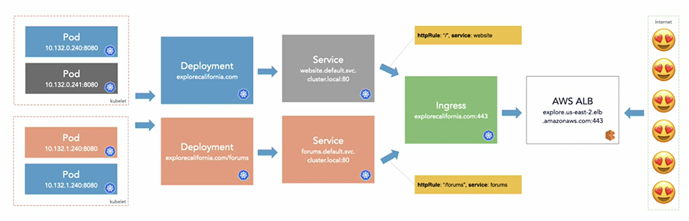

# Kubernetes

Kubernetes es una plataforma de código abierto diseñada para automatizar la implementación, el escalado y las operaciones de aplicaciones en contenedores. Originalmente desarrollado por Google, ahora es mantenido por la Cloud Native Computing Foundation (CNCF).

### ¿Para qué sirve Kubernetes?
Kubernetes se utiliza principalmente para gestionar contenedores en un entorno distribuido. Los contenedores permiten empaquetar aplicaciones con todas sus dependencias, lo que facilita su implementación en diferentes entornos.

- Escalabilidad: Permite escalar aplicaciones fácilmente. Puede añadir o quitar contenedores automáticamente en función de la carga de trabajo.

-  Automatización del Despliegue: Kubernetes puede gestionar automáticamente el despliegue y la supervisión de las aplicaciones, lo que facilita las actualizaciones continuas y reduce el tiempo de inactividad.

- Gestión de Recursos: Administra el uso de recursos del sistema, como CPU y memoria, para garantizar que las aplicaciones reciban los recursos necesarios sin exceder la capacidad del sistema.

- Alta Disponibilidad: Proporciona mecanismos para la recuperación automática en caso de fallos, asegurando que las aplicaciones permanezcan disponibles y operativas.

- Facilidad de Desarrollo y Operaciones: Facilita la colaboración entre equipos de desarrollo y operaciones (DevOps) al proporcionar una infraestructura común y unificada para el desarrollo, prueba y despliegue de aplicaciones.

- Portabilidad: Las aplicaciones gestionadas por Kubernetes pueden ejecutarse en cualquier entorno compatible, desde el local hasta nubes públicas o privadas.



### Componentes Clave de Kubernetes
- Nodo Maestro: Coordina el clúster y gestiona la planificación, el mantenimiento de los estados deseados y la configuración del clúster.
- Nodos de Trabajo: Ejecutan las aplicaciones y las cargas de trabajo en contenedores.
- Pods: La unidad más pequeña de despliegue que puede crear y gestionar Kubernetes. Un pod puede contener uno o más contenedores.
- Servicios: Abstracciones que definen un conjunto lógico de pods y una política para acceder a ellos.
- Controladores: Gestionan el estado de las aplicaciones y garantizan que el número deseado de pods se esté ejecutando en el clúster.

### Terminos
- Infrastructure as Code
    "Infrastructure as Code" es una práctica que consiste en gestionar la infraestructura de TI utilizando código y herramientas de automatización. En lugar de configurar manualmente los servidores y los recursos de red, los administradores de sistemas pueden definir la infraestructura como código y utilizar herramientas de automatización para implementar y gestionar la infraestructura de forma coherente y repetible.
- GitOps
    "GitOps" es una metodología de operaciones de TI que utiliza Git como fuente de verdad para la infraestructura y las aplicaciones. En un entorno de GitOps, los cambios en la infraestructura y las aplicaciones se gestionan a través de solicitudes de extracción (pull requests) en un repositorio de Git, lo que permite a los equipos de operaciones y desarrollo colaborar de forma eficiente y mantener un historial de cambios completo y auditable.
- Cluster
    Un "cluster" es un conjunto de nodos de trabajo y un nodo maestro que forman un entorno de Kubernetes. Los nodos de trabajo ejecutan las aplicaciones y las cargas de trabajo en contenedores, mientras que el nodo maestro coordina y gestiona el clúster en su conjunto.
  - Control plane
    El "control plane" es el componente principal de Kubernetes que gestiona y controla el clúster. Incluye varios componentes, como el API server, el scheduler, el controller manager y el etcd, que trabajan juntos para coordinar y gestionar los recursos del clúster.
  - Worker node
    Un "worker node" es un nodo de un clúster de Kubernetes que ejecuta las aplicaciones y las cargas de trabajo en contenedores. Cada nodo de trabajo tiene un agente de Kubernetes llamado kubelet que se comunica con el nodo maestro y gestiona los contenedores en el nodo.  


## Primeros pasos

#### Crear un cluster con minikube
``` bash
minikube start
kubectl cluster-info
kubectl get nodes
kubectl get namespaces
kubectl get pods -A
kubectl get services -A
``` 

### Workspaces

Los "workspaces" son espacios de trabajo virtuales que permiten a los usuarios organizar y gestionar sus recursos de forma más eficiente. Cada workspace tiene su propio entorno aislado, lo que facilita la colaboración y la gestión de recursos en entornos compartidos.

``` yaml
---
apiVersion: v1
kind: Namespace
metadata:
  name: development
---
apiVersion: v1
kind: Namespace
metadata:
  name: production 
``` 

``` bash
# correr el archivo
kubectl apply -f namespaces.yaml
# eliminar un namespace
kubectl delete -f namespaces.yaml
kubectl delete namespace development
``` 
### Deployments

Un "deployment" es un controlador de Kubernetes que gestiona la implementación y la escalabilidad de las aplicaciones en el clúster. Los deployments permiten definir el estado deseado de las aplicaciones y garantizar que se mantenga en todo momento.

``` yaml
--- 
apiVersion: apps/v1
kind: Deployment
metadata:
  name: pod-info-deployment
  namespace: development
  labels:
    app: pod-info
spec:
  replicas: 1
  selector:
    matchLabels:
      app: pod-info
  template:
    metadata:
      labels:
        app: pod-info
    spec:
      containers:
      - name: pod-info-container
        image: kimschles/pod-info-app:latest
        ports:
        - containerPort: 3000
        env:
          - name: POD_NAME
            valueFrom:
              fieldRef:
                fieldPath: metadata.name
          - name: POD_NAMESPACE
            valueFrom:
              fieldRef:
                fieldPath: metadata.namespace
          - name: POD_IP
            valueFrom:
              fieldRef:
                fieldPath: status.podIP
```

``` bash
kubectl apply -f deployment.yaml
kubectl get deployments -n development
kubectl get pods -n development
kubectl describe deployment pod-info-deployment -n development
kubectl delete deployment pod-info-deployment -n development
```

### Pods

Un pod es la unidad más pequeña de despliegue en Kubernetes y puede contener uno o más contenedores. Los pods comparten recursos como la red y el almacenamiento, lo que facilita la comunicación entre los contenedores y la gestión de los recursos compartidos.

Los pods pueden ser creados via Job, Deployment, StatefulSet, DaemonSet, etc.

``` bash
# listar pods con informacion extra
kubectl get pods -n development -o wide
# describe pod
kubectl describe pod {id} -n development
# delete pod
kubectl delete pod {id} -n development
# logs
kubectl logs {id} -n development
```

### Using BusyBox

BusyBox es una imagen de contenedor ligera y versátil que incluye una colección de utilidades de línea de comandos comunes. Puede ser útil para realizar tareas de depuración y diagnóstico en un clúster de Kubernetes.

``` bash
kubectl apply -f busybox.yaml
kubectl exec -it busybox-54f785c7d7-wqpkh -- /bin/sh
# una vez dentro del contenedor
nslookup pod-info-service.development.svc.cluster.local
wget 10.244.0.3:3000

```

### Kubernetes Services

Un servicio de Kubernetes es una abstracción que define un conjunto lógico de pods y una política para acceder a ellos. Los servicios permiten que las aplicaciones se comuniquen entre sí de forma transparente y escalable, independientemente de su ubicación en el clúster.

``` bash
# start a tunnel
minikube tunnel

# ver servicios
kubectl get services -n development
``` 

``` yaml
---
apiVersion: v1
kind: Service
metadata:
  name: demo-service
  namespace: development
spec:
  selector:
    app: pod-info
  ports:
    - port: 80
      targetPort: 3000
  type: LoadBalancer

```

### Stateful Workloads

Los "StatefulSets" son controladores de Kubernetes que gestionan aplicaciones con estado, como bases de datos y sistemas de almacenamiento. Los StatefulSets garantizan que los pods se mantengan en un estado consistente y persistente, incluso en caso de fallos o reinicios.

Los dos enfoques principales para manejar el almacenamiento en Kubernetes son:
- Persistent Volumes: Almacenamiento persistente que sobrevive a la eliminación de los pods.
- Cluster Storage: Almacenamiento compartido que puede ser accedido por múltiples pods.

### Seguridad

La seguridad en Kubernetes es un aspecto crítico que debe ser tenido en cuenta al implementar aplicaciones en un clúster. Algunas prácticas comunes para mejorar la seguridad en Kubernetes incluyen:

- Limitar los privilegios de los contenedores y los usuarios.
- Utilizar roles y permisos basados en RBAC (Role-Based Access Control).
- Habilitar la autenticación y la autorización en el clúster.
- Implementar políticas de red y firewall para restringir el tráfico no autorizado.
- Monitorizar y auditar los eventos y las actividades del clúster.

### Otras herramientas 

#### kubeadm

Kubeadm es una herramienta de línea de comandos que facilita la creación y gestión de clústeres de Kubernetes. Kubeadm automatiza muchas de las tareas manuales involucradas en la configuración de un clúster, como la inicialización de nodos, la configuración de redes y la instalación de componentes esenciales.

#### Kops

Kops es una herramienta de línea de comandos que facilita la creación, el despliegue y la gestión de clústeres de Kubernetes en la nube. Kops permite configurar clústeres de Kubernetes en entornos de nube pública como **AWS**, GCP y Azure, así como en entornos locales.

#### Helm

Helm es un gestor de paquetes para Kubernetes que facilita la instalación, actualización y gestión de aplicaciones en un clúster. Helm utiliza "charts" para definir la estructura y la configuración de las aplicaciones, lo que permite desplegar aplicaciones de forma rápida y consistente.

#### Dashboard

El Dashboard de Kubernetes es una interfaz web que permite visualizar y gestionar los recursos de un clúster de Kubernetes. El Dashboard proporciona una vista gráfica de los nodos, los pods, los servicios y otros recursos del clúster, lo que facilita la monitorización y la gestión de las aplicaciones.

#### Federation y kubefed

La Federación de Kubernetes es una característica que permite gestionar múltiples clústeres de Kubernetes de forma centralizada. La Federación facilita la implementación y la gestión de aplicaciones en entornos distribuidos, lo que permite escalar y gestionar clústeres de Kubernetes en diferentes ubicaciones geográficas.

#### Kompose

Kompose es una herramienta que facilita la migración de aplicaciones de Docker Compose a Kubernetes. Kompose permite convertir archivos de configuración de Docker Compose en archivos de configuración de Kubernetes,

#### ArgoCD

Argo es una plataforma de código abierto para la implementación y la gestión de aplicaciones en Kubernetes. Argo proporciona herramientas para automatizar el despliegue, la monitorización y la gestión de aplicaciones en un clúster de Kubernetes, lo que facilita la implementación de aplicaciones en entornos de producción.

#### Discovery and Registry

Kubernetes proporciona un mecanismo integrado para descubrir y registrar servicios en el clúster. Los servicios de Kubernetes se registran automáticamente en el clúster y pueden ser descubiertos por otros servicios utilizando el sistema de nombres de Kubernetes.

#### CoreDNS

CoreDNS es un servidor de nombres de dominio (DNS) ligero y flexible que se utiliza en Kubernetes para resolver nombres de servicios y pods en el clúster. CoreDNS reemplaza a kube-dns como el servidor de DNS predeterminado en Kubernetes y proporciona una mayor flexibilidad y escalabilidad para la resolución de nombres en el clúster.

#### Harbor

Harbor es un registro de contenedores de código abierto que se utiliza para almacenar, distribuir y gestionar imágenes de contenedores en Kubernetes. Harbor proporciona una interfaz de usuario basada en web para la gestión de imágenes, así como características avanzadas de seguridad y control de acceso para proteger las imágenes de contenedores.

#### Service Mesh

Un "service mesh" es una capa de red que se utiliza para gestionar la comunicación entre los servicios de una aplicación distribuida. Los service meshes proporcionan funciones avanzadas de monitorización, seguridad y gestión del tráfico para mejorar la fiabilidad y la seguridad de las aplicaciones en entornos de microservicios. Linkerd y Istio son dos de los service meshes más populares para Kubernetes.

#### Prometheus

Prometheus es un sistema de monitorización y alerta de código abierto que se utiliza en Kubernetes para recopilar, almacenar y visualizar métricas de los servicios y las aplicaciones en el clúster. Prometheus proporciona una interfaz de consulta y visualización de métricas, así como capacidades avanzadas de alerta y notificación para monitorizar el estado de las aplicaciones en tiempo real. Se puede integrar con herramientas como Grafana para visualizar y analizar las métricas de forma más detallada.

#### Vitess

Vitess es un sistema de escalado de bases de datos de código abierto que se utiliza en Kubernetes para gestionar bases de datos MySQL a escala. Vitess proporciona capacidades avanzadas de particionamiento, replicación y escalabilidad para mejorar el rendimiento y la disponibilidad de las bases de datos en entornos de Kubernetes.

#### Fluentd

Fluentd es un recolector de logs de código abierto que se utiliza en Kubernetes para recopilar, filtrar y enviar registros de aplicaciones y servicios en el clúster. Fluentd proporciona una interfaz unificada para recopilar registros de múltiples fuentes y enviarlos a destinos como Elasticsearch, Kafka y S3 para su análisis y almacenamiento.

#### Tracing

La trazabilidad es una técnica que se utiliza en Kubernetes para rastrear y monitorizar las solicitudes y las transacciones a través de los servicios de una aplicación distribuida. Las herramientas de trazabilidad como Jaeger y Zipkin proporcionan capacidades avanzadas de seguimiento y monitorización para identificar cuellos de botella, errores y problemas de rendimiento en los servicios de una aplicación.

#### Security

La seguridad es un aspecto crítico en Kubernetes que debe ser tenido en cuenta al implementar aplicaciones en un clúster. Algunas prácticas comunes para mejorar la seguridad en Kubernetes incluyen:
- Codigo: Diseño y codigo seguro
- Imagenes: 
  - Utilizar imagenes seguras
    Se puede utilizar servicios image signing como TUF y Notary
  - Limitar los privilegios de los contenedores y los usuarios.
- Containers
  - Asegurar el ambiente de trabajo
  - Asegurar container networking
  - Asegurar el sistema operativo host
- Kubernetes
  - Seguridad en Kubernetes (componentes)
    - Aislacion de pods
    - Control de acceso de aplicaciones
      - Autenticacion
        - Usuarios
        - Cuentas de servicio
      - Autorizacion
        - Utilizar roles y permisos basados en RBAC (Role-Based Access Control).
      - Admicion de control
        - Intercepta y verifica las solicitudes
    - Seguridad de pods
      - Politicas
      - Recomendaciones
      - Perfiles
      - Modos
    - Seguridad de networks
    - Seguridad de contexto y politicas
    - Uso de secretos
  - Seguridad de Kubernetes (infraestructura)
    - Malas configuraciones
    - Configuraicon de acceso
    - Comunicacion entre componentes del nucleo de Kubernetes
- Cluseter
  - Proteger trafico del API server
  - Proteger componentes del cluster
  - Proteger utilizacion de recursos
  - Proteger secretos

  
  - Habilitar la autenticación y la autorización en el clúster.
  - Implementar políticas de red y firewall para restringir el tráfico no autorizado.
  - Monitorizar y auditar los eventos y las actividades del clúster.


#### Links
- https://www.cncf.io/blog/2018/03/08/introducing-the-cloud-native-landscape-2-0-interactive-edition/


