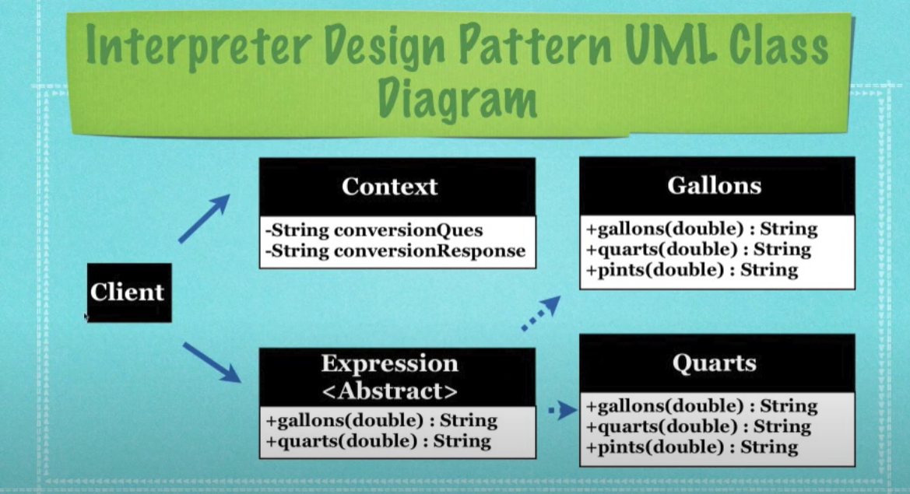

# Interpreter

Used for converting one representation of data into another one. Is a way of translating one language into another. It defines a grammar, then uses an abstract syntax tree to interpret it.

El patrón Interpreter es un patrón de diseño de comportamiento que se utiliza para definir una representación gramatical de un lenguaje y proporcionar un intérprete para tratar las oraciones de dicho lenguaje. Este patrón es útil cuando necesitas evaluar o interpretar expresiones en un lenguaje específico.

### Use Cases
- SQL parser
- Compilers
- Regular expressions



### Components
- Context
- Expression
- Terminal or Concrete expression

### Example

```java
public interface Expression {
    String interpret(String context);
}

public class NoWhitespace implements Expression {
    @Override
    public String interpret(String context) {
        return context.replaceAll(" ", "");
    }
}

public class FirstLetterShouldBeLowerCase implements Expression {

    private final NoWhitespace noWhitespace = new NoWhitespace();

    @Override
    public String interpret(String context) {
        context = context.substring(0, 1).toLowerCase() + context.substring(1);
        return noWhitespace.interpret(context);
    }
}

public class FirstLetterShouldNotBeUnderscore implements Expression {

    private final FirstLetterShouldBeLowerCase firstLetterShouldBeLowerCase = new FirstLetterShouldBeLowerCase();
    @Override
    public String interpret(String context) {
        if (context.startsWith("_")) {
            context = context.substring(1);
        }
        return firstLetterShouldBeLowerCase.interpret(context);
    }
}

public class App {
    public static void main(String[] args) {
        var context = "_My Variable";
        var firstLetterShouldNotBeUnderscore = new FirstLetterShouldNotBeUnderscore();
        var result = firstLetterShouldNotBeUnderscore.interpret(context);
        System.out.println(result);
    }
}


```

### GPT example
```java
import java.util.Map;

// Interfaz del intérprete
interface Expression {
    int interpret(Map<String, Integer> context);
}

// Clase para interpretar números
class Number implements Expression {
    private final int number;

    public Number(int number) {
        this.number = number;
    }

    @Override
    public int interpret(Map<String, Integer> context) {
        return number;
    }
}

// Clase para interpretar sumas
class Plus implements Expression {
    private final Expression leftOperand;
    private final Expression rightOperand;

    public Plus(Expression leftOperand, Expression rightOperand) {
        this.leftOperand = leftOperand;
        this.rightOperand = rightOperand;
    }

    @Override
    public int interpret(Map<String, Integer> context) {
        return leftOperand.interpret(context) + rightOperand.interpret(context);
    }
}

// Clase para interpretar restas
class Minus implements Expression {
    private final Expression leftOperand;
    private final Expression rightOperand;

    public Minus(Expression leftOperand, Expression rightOperand) {
        this.leftOperand = leftOperand;
        this.rightOperand = rightOperand;
    }

    @Override
    public int interpret(Map<String, Integer> context) {
        return leftOperand.interpret(context) - rightOperand.interpret(context);
    }
}

// Ejemplo de uso
public class InterpreterExample {
    public static void main(String[] args) {
        // Construimos la expresión (5 + 3) - (2 + 1)
        Expression expression = new Minus(
            new Plus(new Number(5), new Number(3)),
            new Plus(new Number(2), new Number(1))
        );

        // Evaluamos la expresión
        int result = expression.interpret(Map.of());
        System.out.println("Resultado: " + result); // Resultado: 5
    }
}

```