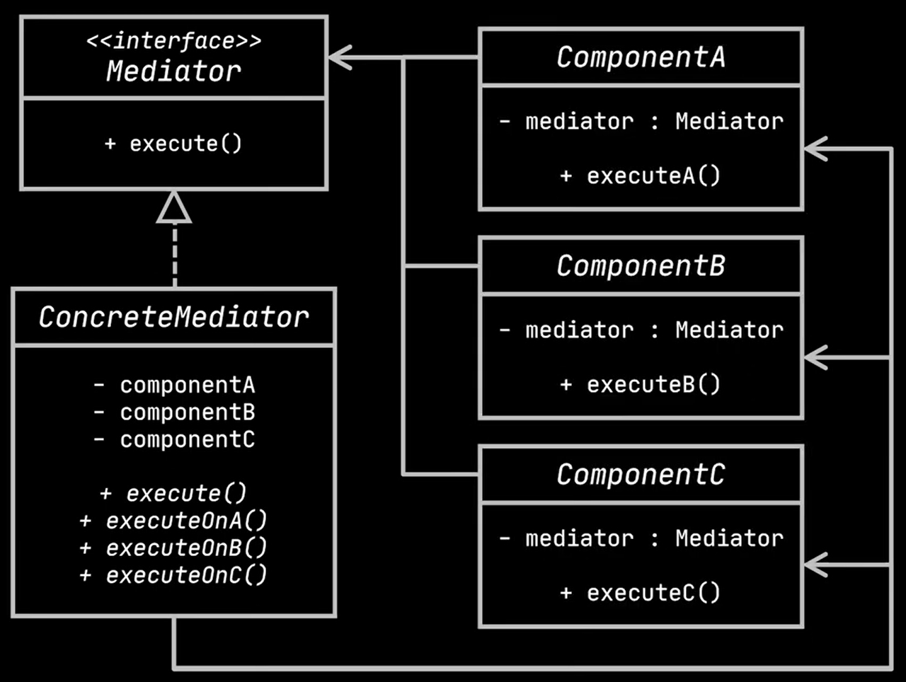

# Mediator

Define an object that encapsulates how a set of objects interact. Mediator promotes loose coupling by keeping objects from referring to each other explicitly, and it lets you vary their interaction independently.




### Applicability

Use the Mediator pattern when:
- a set of objects communicate in well-defined but complex ways. The resulting interdependencies are unstructured and difficult to understand.
- reusing an object is difficult because it refers to and communicates with many other objects.
- a behavior that's distributed between several classes should be customizable without a lot of subclassing.

### LinkedIn example
```java

public class Ticket {


  private Assignee assignee;
    public enum Status {
        SUBMITTED,
        IN_PROGRESS,
        DONE
    }

    private Status status;

    public Ticket() {
        this.status = Status.SUBMITTED;
    }

    public Status getStatus() {
        return this.status;
    }

    public void setStatus(Status status) {
        this.status = status;
        System.out.println("Ticket status changed to " + status);
    }

    public void setAssignee(Assignee assignee) {
        this.assignee = assignee;
    }

}


public class Assignee {

    private List<Ticket> tickets = new ArrayList<>();

    public List<Ticket> getTickets() {
        return this.tickets;
    }

    public void pickUpTicket(Ticket ticket) {
        System.out.println("Ticket picked up by assignee");
        tickets.add(ticket);
    }

    public void resolveTicket(Ticket ticket) {
        tickets.remove(ticket);
        System.out.println("Ticket resolved");
    }

}

public class Board {
    private List<Ticket> inProgressTickets = new ArrayList<>();
    private List<Ticket> doneTickets = new ArrayList<>();

    public List<Ticket> getDoneTickets() {
        return this.doneTickets;
    }

    public void addTicketToInProgressTickets(Ticket ticket) {
        inProgressTickets.add(ticket);
        System.out.println("Ticket added to inProgressTickets");
    }

    public void addTicketToDoneTickets(Ticket ticket) {
        doneTickets.add(ticket);
        System.out.println("Ticket added to doneTickets");
        inProgressTickets.remove(ticket);
        System.out.println("Ticket removed from inProgressTickets");
    }


}

public class Mediator {

    private Ticket ticket;
    private Assignee assignee;
    private Board board;

    public Mediator(Ticket ticket, Assignee assignee, Board board) {
        this.ticket = ticket;
        this.assignee = assignee;
        this.board = board;
    }

    public void pickUpTicket() {
        assignee.pickUpTicket(ticket);
        ticket.setAssignee(assignee);
        ticket.setStatus(Ticket.Status.IN_PROGRESS);
        board.addTicketToInProgressTickets(ticket);
    }

    public void resolveTicket() {
        assignee.resolveTicket(ticket);
        ticket.setStatus(Ticket.Status.DONE);
        board.addTicketToDoneTickets(ticket);
    }

}

public class App {

    public static void main(String[] args) {

        var board = new Board();
        var ticket = new Ticket();
        var assignee = new Assignee();

        var mediator = new Mediator(ticket, assignee, board);
        mediator.pickUpTicket();
        System.out.println();
        mediator.resolveTicket();


    }

}


```

### GPT Example
```java
// Interfaz Mediator
interface Mediator {
    void notify(Component sender, String event);
}

// Interfaz Component
abstract class Component {
    protected Mediator mediator;

    public Component(Mediator mediator) {
        this.mediator = mediator;
    }

    public void setMediator(Mediator mediator) {
        this.mediator = mediator;
    }

    public abstract void send(String event);
    public abstract void receive(String event);
}

// Clase concreta de Mediator
class ConcreteMediator implements Mediator {
    private Button button;
    private TextBox textBox;
    private Label label;

    public void setButton(Button button) {
        this.button = button;
    }

    public void setTextBox(TextBox textBox) {
        this.textBox = textBox;
    }

    public void setLabel(Label label) {
        this.label = label;
    }

    @Override
    public void notify(Component sender, String event) {
        if (sender instanceof Button && event.equals("click")) {
            textBox.receive("Button clicked");
            label.receive("Button clicked");
        } else if (sender instanceof TextBox && event.equals("input")) {
            label.receive("Text input: " + textBox.getText());
        }
    }
}

// Componentes concretos
class Button extends Component {
    public Button(Mediator mediator) {
        super(mediator);
    }

    @Override
    public void send(String event) {
        mediator.notify(this, event);
    }

    @Override
    public void receive(String event) {
        System.out.println("Button received: " + event);
    }

    public void click() {
        send("click");
    }
}

class TextBox extends Component {
    private String text;

    public TextBox(Mediator mediator) {
        super(mediator);
    }

    @Override
    public void send(String event) {
        mediator.notify(this, event);
    }

    @Override
    public void receive(String event) {
        System.out.println("TextBox received: " + event);
    }

    public void input(String text) {
        this.text = text;
        send("input");
    }

    public String getText() {
        return text;
    }
}

class Label extends Component {
    public Label(Mediator mediator) {
        super(mediator);
    }

    @Override
    public void send(String event) {
        mediator.notify(this, event);
    }

    @Override
    public void receive(String event) {
        System.out.println("Label received: " + event);
    }
}

// Ejemplo de uso
public class MediatorExample {
    public static void main(String[] args) {
        ConcreteMediator mediator = new ConcreteMediator();

        Button button = new Button(mediator);
        TextBox textBox = new TextBox(mediator);
        Label label = new Label(mediator);

        mediator.setButton(button);
        mediator.setTextBox(textBox);
        mediator.setLabel(label);

        button.click(); // Simula un clic en el botón
        textBox.input("Hello, World!"); // Simula la entrada de texto
    }
}

```
