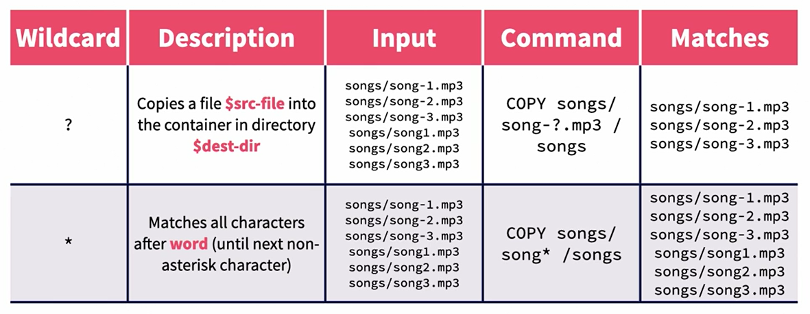

# Docker: Deep Dive

### Main files and directories

- `/var/lib/docker` - Docker's data directory
- `/var/run/docker.sock` - Docker's socket file
- `/etc/docker/daemon.json` - Docker's configuration file

### Installing docker on Ubuntu

```bash
curl -L https://get.docker.io | bash
```

### Portainer

Portainer is a web-based management UI for Docker. It allows you to manage containers, images, networks, and volumes.

```bash
docker run -d -p 8000:8000 -p 9443:9443 --name portainer --restart=always -v /var/run/docker.sock:/var/run/docker.sock -v portainer_data:/data portainer/portainer-ce:latest
```

### Course excericses

```bash
docker pull ngix:latest

```

### Dockerfile in depth
- Base image
```Dockerfile
    # FROM
    # Command that describes the base image that this Dockerfile's image will be created from
    # it must be the first command in the Dockerfile
    FROM ubuntu:latest
```

- Copy files
```Dockerfile
    # 1) Copy a file from the host to the container
    # COPY $source-file $destination-file
    COPY index.html /var/www/html/index.html
    # 2) Copy a file into a directory
    # COPY $source-file $destination-directory
    COPY index.html /var/www/html/
    # 3) Copy a directory into a directory
    # COPY $source-directory $destination-directory
    COPY src/ /var/www/html/
```

- Copy Wildcards



- Run command
```Dockerfile
    # RUN
    # Command that will be executed when the image is built
    # RUN $command
    RUN apt-get update
    RUN apt-get install -y nginx
    
    # alternative syntax
    RUN["apt-get", "update"]
    RUN["apt-get", "install", "-y", "nginx"]
```

- Entrypoint
```Dockerfile
    # ENTRYPOINT
    # Command that will be executed when the container is started
    # ENTRYPOINT $command
    ENTRYPOINT ["nginx", "-g", "daemon off;"]
```

- CMD
```Dockerfile
    # CMD
    # Command that will be executed when the container is started
    # CMD $command
    CMD ["nginx", "-g", "daemon off;"]
```

### Combining CMD and Entrypoint


### When to use an entrypoint and when to use a CMD?

- Use an entrypoint when you want to provide a command that will always be executed when the container is started
- Use a CMD when you want to provide a default command that can be overwritten by the user on the run command
- CMD is best suited for providing command-line arguments to the entrypoint