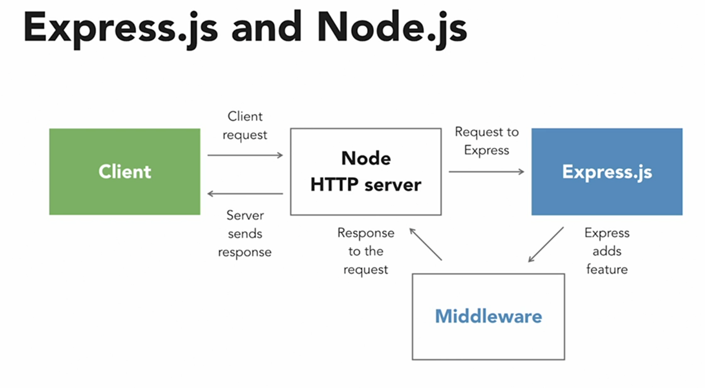

# Express

Express is a minimal and flexible Node.js web application framework that provides a robust set of features for web and mobile applications.



## Middleware

Middleware functions are functions that have access to the request object (req), the response object (res), and the next middleware function in the application’s request-response cycle. The next middleware function is commonly denoted by a variable named next.

Middleware functions can perform the following tasks:

- Execute any code.
- Make changes to the request and the response objects.
- End the request-response cycle.
- Call the next middleware function in the stack.

If the current middleware function does not end the request-response cycle, it must call next() to pass control to the next middleware function. Otherwise, the request will be left hanging.

## Express application generator

The Express application generator is a tool that helps you quickly create an Express application skeleton. You can install the generator by running the following command:

```bash
$ npm install express-generator -g
```

After installing the generator, you can create a new Express application by running the following command:

```bash
$ express --git --hbs testapp
# hbs is handlebars view engine
```

This command will create a new directory named myapp in the current working directory. The directory will contain the files and folders for your new Express application.


## Seting up an express app from scratch

1. Create a new directory for your app and navigate into it:

    ```bash
    $ mkdir myapp
    $ cd myapp
    ```

2. Run npm init to create a package.json file for your app:

    ```bash
    $ npm init
    ```
3. Install Express and nodemon:

    ```bash
    $ npm install express nodemon
    ```

4. Install babel:

    ```bash
    $ npm install --save-dev @babel/core @babel/cli @babel/preset-env @babel/node

    # NOTE: babel is a JavaScript compiler that allows you to use the latest features of JavaScript today. 

    ```

5. Create a .babelrc file in the root of your project and add the following code:

    ```json
    {
    "presets": ["@babel/preset-env"]
    }
    ```

6. Adjust package.json like this:

    ```json
    {
    "name": "express-essentials",
    "version": "1.0.0",
    "type": "module",
    "description": "",
    "main": "index.js",
    "scripts": {
        "start": "nodemon --experimental-json-modules --exec babel-node index.js"
    },
    "author": "Jamie Pittman",
    "license": "ISC",
    "dependencies": {
        "express": "^4.17.1",
        "nodemon": "^2.0.12"
    },
    "devDependencies": {
        "@babel/cli": "^7.15.4",
        "@babel/core": "^7.15.5",
        "@babel/node": "^7.15.4",
        "@babel/preset-env": "^7.15.6"
    }
    }

    ```

7. Create the entry point named index.js with this content:

    ```javascript
    import express from 'express';

    const app = express();
    const PORT = 3000;

    app.listen(PORT, () => console.log(`The server is running on port ${PORT}`));


    ```

## Mocking data

You can use mockaroo.com to generate fake data for your app.
